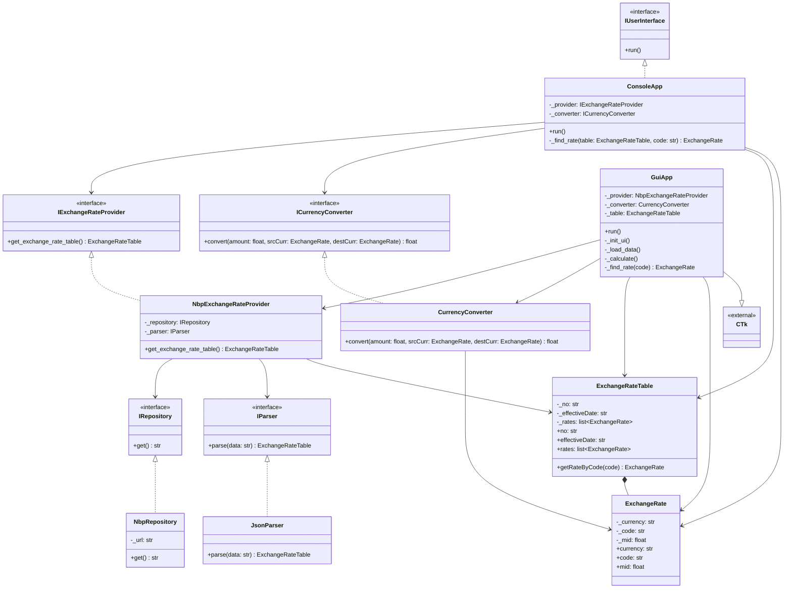

# NBP Currency Exchanger

A modular and extensible Python application for currency conversion, utilizing real-time exchange rates from the National Bank of Poland (NBP) API.

This project was designed as a practical demonstration of **Object-Oriented Programming (OOP)** and **SOLID principles**, focusing on Clean Architecture, testability, and separation of concerns.

## 🚀 Key Features

- **Real-time Data:** Fetches current exchange rate tables (Table A) directly from the NBP API.
- **Cross-Currency Conversion:** Calculates exchange rates between any two currencies (e.g., USD to EUR) using PLN as the base pivot.
- **Dual Interface:**
  - **GUI:** Modern interface built with `customtkinter`.
  - **CLI:** Lightweight console-based interface.
- **Error Handling:** Robust handling of network issues and parsing errors.

## 🏗️ Architecture & Design Principles

The core strength of this project lies in its architecture. It strictly follows **SOLID principles** to ensure code maintainability and scalability.

### Applied Principles:

- **SRP (Single Responsibility Principle):** Each class has a distinct purpose.
  - `NbpRepository` handles HTTP requests.
  - `JsonParser` handles data transformation.
  - `CurrencyConverter` handles mathematical logic.
  - `GuiApp`/`ConsoleApp` handle user interaction.
- **OCP (Open/Closed Principle):** The system is open for extension but closed for modification. For example, adding an XML parser or a different API source can be done by creating new classes without altering existing logic.
- **LSP (Liskov Substitution Principle):** Implementations of interfaces (e.g., `NbpRepository` implementing `IRepository`) can be used interchangeably without breaking the application.
- **ISP (Interface Segregation Principle):** Interfaces like `ICurrencyConverter` or `IParser` are specific and focused.
- **DIP (Dependency Inversion Principle):** High-level modules (like `NbpExchangeRateProvider`) do not depend on low-level modules; both depend on abstractions (Interfaces). Dependencies are injected via the constructor (**Dependency Injection**).

### Project Structure:

- **`Interfaces/`**: Abstract Base Classes defining contracts (e.g., `IRepository`, `IParser`).
- **`DTOs/`**: Data Transfer Objects representing the domain state (`ExchangeRate`, `ExchangeRateTable`).
- **`Repositories/`**: Data access layer (fetching raw data from NBP).
- **`Parsers/`**: Logic for transforming raw strings (JSON) into DTOs.
- **`Services/`**: Business logic (Conversion logic, Data providing orchestration).
- **`UI/`**: Presentation layer (Console and CustomTkinter implementations).

## 🧩 UML Diagram

## 🛠️ Tech Stack

- **Language:** Python 3.10+
- **GUI:** CustomTkinter
- **Network:** Requests library
- **Format:** JSON
